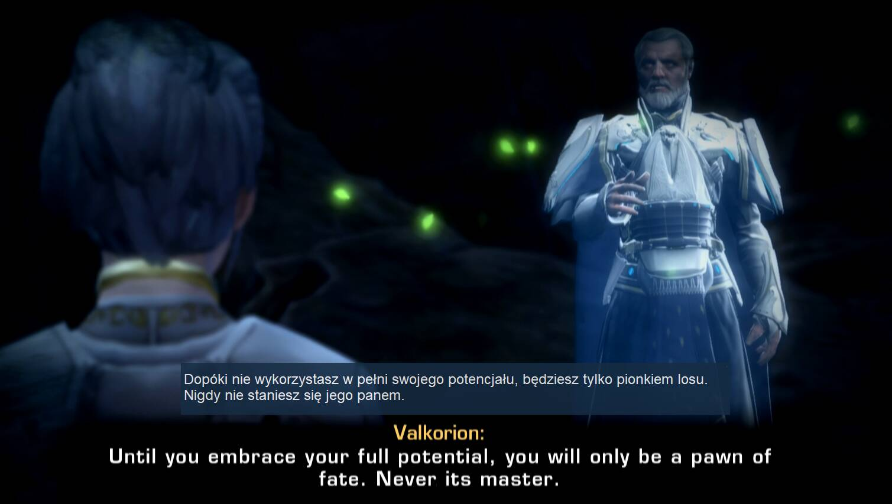

# Game-Changing Translator

Copyright (C) 2025-2026 Tomasz Kaminski

This fork was modified with assistance from GPT-5.5.



## Overview

Game-Changing Translator is a desktop OCR translation application that captures text from a selected screen area, runs OCR, and translates the result in real time. It can display translations in a floating overlay, which makes it useful for games, videos, PDFs, and other applications where text cannot be copied directly.

The current runtime path supports local Tesseract OCR or Custom AI OCR, then translates through Custom AI profiles that point at OpenAI-compatible endpoints. Older provider modules and resource files remain in the repository for compatibility/history, but the active UI/runtime path is centered on Custom AI profiles rather than the legacy built-in DeepL, Google, Gemini, OpenAI, or MarianMT translation routes.

## Core Features

- Screen area selection for OCR input and translation output
- Real-time OCR and translation loop
- Floating translation overlay
- Tesseract OCR support
- Custom AI OCR with WebP, PNG, and JPEG image payload options
- Custom AI/OpenAI-compatible endpoint translation
- Translation caching to reduce repeated API calls
- Custom prompt and custom provider profile support
- Configurable appearance, font, colour, and transparency
- Hotkey support for controlling translation while another app is focused

## Installation

### Prerequisites

- Windows
- [Tesseract OCR](https://github.com/UB-Mannheim/tesseract/wiki)
- Python 3.9-3.12

### Setup

1. Clone this repository:

   ```bash
   git clone https://github.com/yun-666-666/OCR-Translator.git
   ```

2. Install required Python packages:

   ```bash
   pip install -r requirements.txt
   ```

3. Run the application:

   ```bash
   python main.py
   ```

## Quick Start

1. Launch the application.
2. Select the OCR source area.
3. Select the translation output area.
4. Configure the OCR and translation provider in Settings.
5. Click Start to begin translation.
6. Use the configured hotkey to toggle translation while working or playing.

## Configuration And Secrets

Do not commit real API keys or personal provider profiles. The runtime config file `ocr_translator_config.ini`, API logs, debug logs, cache files, and local backup folders are intentionally ignored by Git.

Use `ocr_translator_config.example.ini` as a clean starting point for a publishable configuration template.

Custom AI profile settings are the main way to configure online OCR and translation providers. The legacy provider files are kept in the tree, but new runtime work should treat `custom_ai` plus `unified_translation_cache.py` as the primary implementation path.

## Licence

This project is free software, licensed under the GNU General Public Licence version 3 (GPLv3).

You can:

- Use the software for any purpose
- Change the software to suit your needs
- Share the software and your changes with others

This program is distributed in the hope that it will be useful, but WITHOUT ANY WARRANTY. See the [LICENSE](LICENSE) file for complete details.

## Acknowledgments

- [Tesseract OCR](https://github.com/tesseract-ocr/tesseract)
- Modified with assistance from GPT-5.5

## Contributing

Please keep attribution to the original author. Read [ATTRIBUTION.md](ATTRIBUTION.md) before forking or using this code.

[](https://www.gnu.org/licenses/gpl-3.0)
[](ATTRIBUTION.md)
[](https://github.com/tomkam1702)
